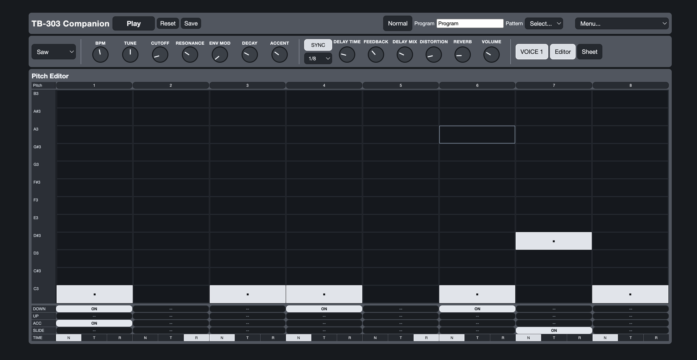
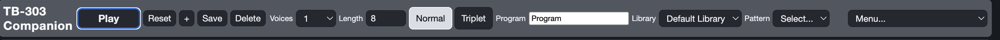
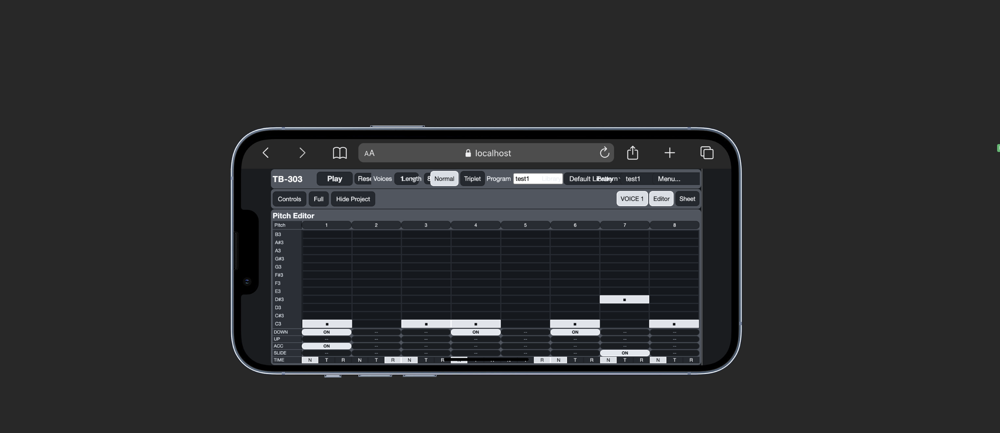
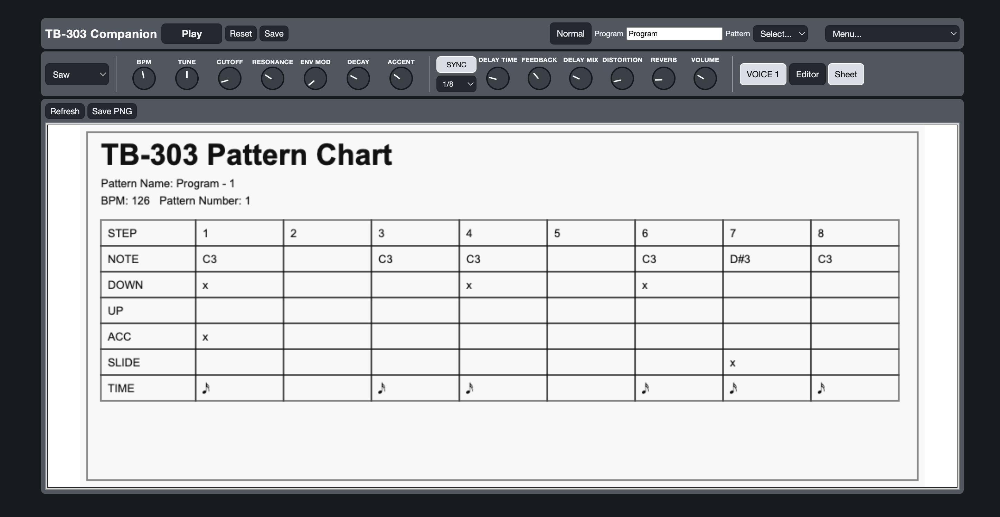
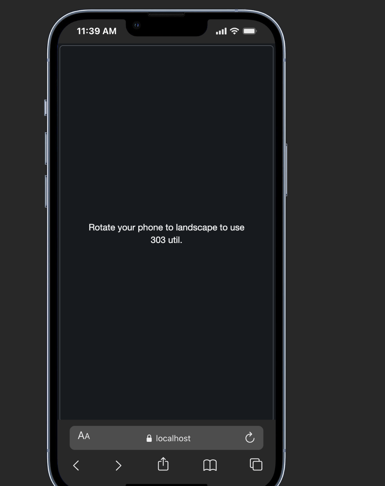

# 303 util User Manual

**303 util** is a compact TB-303 pattern editor, playback tool, and printable pattern-sheet generator. This manual is written for end users and covers the full app workflow: creating libraries, building patterns, working with 1-3 voices, using scale mode, exporting sheets, saving and opening project files, and backing up your saved work to Google Drive.

## Quick start

If you just want to make your first pattern quickly:

1. Open the app.
2. Type a name in **Program**.
3. In **Editor**, click notes into the grid.
4. Set the **TIME** row to `N` (note), `T` (tie), or `R` (rest).
5. Press **Play** to hear the pattern.
6. Use **Save** to store it as a pattern.
7. Open **Sheet**, click **Refresh**, then **Save PNG** to export a printable chart.

## Interface at a glance

The app is organized into four working areas:

| Area | What it does |
| --- | --- |
| **Top bar** | Playback, reset, save, timing mode, program name, pattern selection, root note, scale mode, and the main menu |
| **Controls** | BPM, waveform, synth settings, and FX for the selected voice |
| **Editor** | Pitch grid and step controls for building the sequence |
| **Sheet** | Generates a clean export of the active project as a PNG |

## Core workflow: how a project is organized

The app works with three levels:

| Item | Meaning |
| --- | --- |
| **Program** | The current working project name shown in the top bar |
| **Pattern** | A saved pattern you can open later |
| **Library** | A collection of saved patterns |

Important behavior:

- Editing the grid or controls changes what you are currently working on immediately.
- Those edits are **not added to the pattern library until you save**.
- Choosing another pattern from the **Pattern** list loads it right away, so save first if you want to keep your changes.

## Top bar controls

### Play / Stop

Starts or stops playback of the active project.

### Reset

Clears the notes and step programming in the editor. Your voice settings, FX settings, and project structure stay in place.

### Save

Saves the current working project to the selected pattern.

- If a saved pattern is already selected, it updates that pattern.
- If no saved pattern is selected yet, the app asks for a name and creates a new saved pattern.

### Normal / Triplet

Switches the timing mode for the project.

- **Normal** mode supports pattern lengths from **4 to 16** steps per voice.
- **Triplet** mode supports pattern lengths from **4 to 12** steps per voice.

If you switch timing mode and a voice is longer than the new limit, its visible length is reduced automatically.

### Program

This is the name of the current working project. It is also used in exported file names.

### Pattern

Shows saved patterns in the currently selected library. Selecting one opens it immediately.

### Root

Chooses the root note used by **Scale** mode.

- The root selector is available in the top bar.
- It becomes active when a scale is selected.
- The root note row in the editor is highlighted with its own color.

### Scale

Turns scale mode **Off** or loads one of the available scales or chord shapes.

- Choose **Off** if you do not want note highlighting.
- Choose any scale preset to highlight notes that belong to that scale.
- The selected root note uses one highlight color.
- The rest of the notes that belong to the selected scale use a second highlight color.

### Menu...

This is where project management and storage actions live:

- **Voices**
- **Length**
- **Library**
- **Export JSON**
- **Export PNG**
- **Import JSON**
- **New Pattern**
- **Save Pattern**
- **Delete Pattern**
- **New Library**
- **Delete Library**
- **Connect Google Drive**
- **Backup to Google Drive now**

## How to create and manage libraries

Libraries help you organize pattern collections by song, live set, style, or project.

### Create a new library

1. Open **Menu...**
2. Choose **New Library**
3. Enter a library name

The new library becomes the active library immediately.

### Switch to another library

1. Open **Menu...**
2. Choose **Library**
3. Type the library name
4. Confirm

Only patterns from the selected library appear in the **Pattern** list.

### Delete a library

1. Open **Menu...**
2. Choose **Delete Library**
3. Confirm deletion

Important:

- Deleting a library also deletes **all patterns inside it**.
- **Default Library** cannot be deleted.

## How to create, save, load, and delete patterns

### Create a new empty pattern

1. Open **Menu...**
2. Choose **New Pattern**
3. Enter a pattern name

This creates a fresh blank pattern in the current library and opens it immediately.

### Save the current project as a pattern

Use either:

- **Save** in the top bar, or
- **Menu... > Save Pattern**

If the current project has not been saved before, the app asks for a pattern name and creates it in the current library.

### Load a saved pattern

1. Open the **Pattern** drop-down in the top bar
2. Select the pattern you want

The selected pattern loads immediately.

### Delete a pattern

1. Select the pattern you want to remove
2. Open **Menu...**
3. Choose **Delete Pattern**
4. Confirm

After deletion, the app opens a new blank unsaved pattern.

## Multi-303 support: working with 1, 2, or 3 voices

303 util can run up to **three independent 303 voices** in one project.

### Set the number of voices

1. Open **Menu...**
2. Choose **Voices**
3. Enter `1`, `2`, or `3`

### Edit a specific voice

Use the **VOICE 1**, **VOICE 2**, and **VOICE 3** buttons to choose which voice you are editing.

Each voice has its own:

- notes
- step modifiers
- pattern length
- waveform
- synth settings
- FX settings

### What multi-voice means in practice

- Playback runs all active voices together.
- You edit one voice at a time.
- The **Sheet** export includes all active voices.
- A saved pattern stores all active voices together, not only the voice you are editing.

## How to build a pattern in the Editor

In **Editor** view, the selected voice is edited step by step.

### Add or remove notes

Click a cell in the pitch grid to place a note on that step.

### Use scale mode while editing

If you want visual note guidance:

1. Choose a **Scale** in the top bar
2. Choose a **Root**
3. Return to the pitch grid and place notes as usual

What you will see:

- the **root note row** is highlighted in its own color
- the other **notes inside the selected scale** are highlighted in a different color
- notes outside the scale stay unhighlighted

Scale mode is a visual guide only. It does not block you from placing notes outside the highlighted rows.

### Choose the step type

Use the **TIME** row at the bottom of the editor:

- **N** = note
- **T** = tie
- **R** = rest

### Use the performance lanes

The rows above **TIME** add classic 303 sequencing behavior:

- **DOWN**: transpose the note down
- **UP**: transpose the note up
- **ACC**: accent the note
- **SLIDE**: glide from the previous note into this one

These options work only on active note steps.

### Change the pattern length

Pattern length is set per voice.

1. Select the voice you want to edit
2. Open **Menu...**
3. Choose **Length**
4. Enter the new step count

Limits:

- **Normal** mode: 4-16 steps
- **Triplet** mode: 4-12 steps

## Sound controls and FX

The controls section always edits the **currently selected voice**.

### Main synth controls

- **BPM**: playback speed for the whole project
- **Wave**: saw or square waveform
- **Tune**: pitch offset
- **Cutoff**: filter brightness
- **Resonance**: filter peak intensity
- **Env Mod**: filter envelope amount
- **Decay**: note length and contour
- **Accent**: strength of accented notes

### FX controls

- **SYNC / FREE**: choose tempo-synced delay or manual delay time
- **Delay subdivision**: rhythmic delay value when sync is on
- **Delay Time**: manual delay time when sync is off
- **Feedback**
- **Delay Mix**
- **Distortion**
- **Reverb**
- **Volume**

Tip: select a different voice first if you want different sound settings per voice.

## Sheet view and PNG export

The **Sheet** view creates a clean pattern chart for printing, sharing, or storing with your music notes.

### Export a pattern sheet

1. Set the project up the way you want it
2. Set the number of voices in **Menu... > Voices**
3. Switch to **Sheet**
4. Click **Refresh**
5. Click **Save PNG**

The PNG export includes:

- program name
- BPM
- all active voices
- note rows
- transpose, accent, slide, and time information

## JSON import and export

Use project files when you want to move one pattern setup between devices, keep manual backups, or send it to someone else.

### Export JSON

1. Open **Menu...**
2. Choose **Export JSON**

This downloads what you are currently working on as a project file.

### Import JSON

1. Open **Menu...**
2. Choose **Import JSON**
3. Select a project file you exported earlier

The imported project opens immediately.

Important:

- Importing JSON does **not** automatically save it into your pattern library.
- If you want it available in the **Pattern** list later, use **Save** after importing.

## Google Drive backup and sync

Google Drive support is for backing up your saved libraries and patterns.

### Connect Google Drive

1. Open **Menu...**
2. Choose **Connect Google Drive**
3. Sign in and approve access if prompted

When the connection succeeds, the app checks Google Drive for the latest backup.

### What happens when you connect

- If no backup exists yet, the app stays connected and is ready to create one.
- If Google Drive has newer saved data than the current device, the app restores that backup locally.
- If your local saved data is newer, the app keeps your local data.
- The backup file is stored in your Google Drive inside **TB-303 Companion Backups**.

### Run a backup manually

1. Open **Menu...**
2. Choose **Backup to Google Drive now**

Once Google Drive is connected, saved libraries and saved patterns also sync automatically after changes. **Backup to Google Drive now** is the manual force-sync option.

### What Google Drive backup includes

Google Drive backup stores:

- libraries
- saved patterns
- the last selected library
- the last selected pattern

### What Google Drive backup does not include until you save

Unsaved edits in the current pattern are **not** part of the library backup yet. Save the pattern first if you want those changes included.

## Using the app on phone or small screens

303 util also works in a compact layout.

On smaller screens:

- use **Controls** to show or hide the sound section
- use **Project** to show or hide the editor area
- use **Full** for fullscreen mode when available
- use the **VOICE** buttons and **Editor / Sheet** buttons to move between views quickly

## Recommended workflow

For a clean and safe daily workflow:

1. Create or choose a **Library**
2. Create a **New Pattern**
3. Enter notes and timing in **Editor**
4. Shape the sound for each voice
5. Set **Voices** and **Length**
6. Press **Save**
7. Export **JSON** or **PNG** if needed
8. Use **Google Drive** backup for cloud protection

## Practical tips

- Save before switching patterns.
- Save before importing another project.
- Save before relying on Google Drive backup.
- Remember that deleting a library deletes every pattern inside it.
- Use separate libraries for different songs or performance sets.
- Use multiple voices when you want layered acid lines in one saved project.
