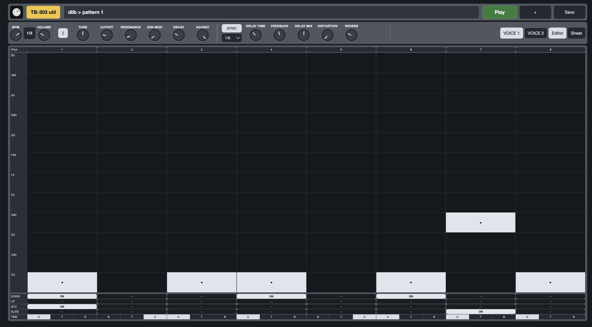
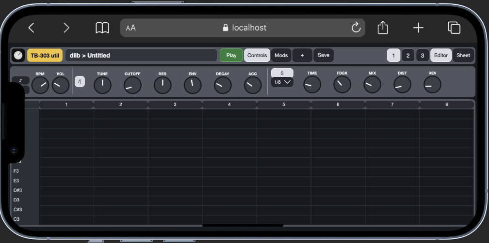
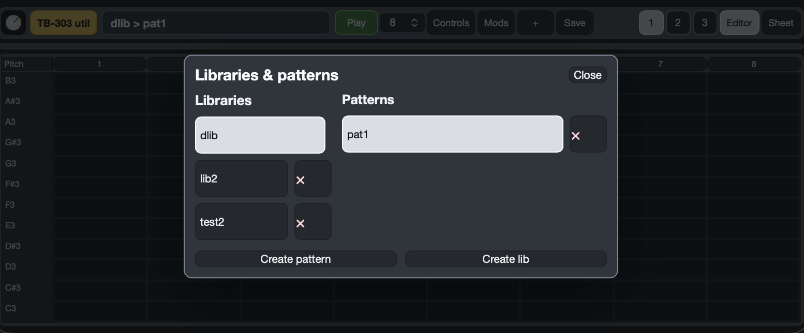
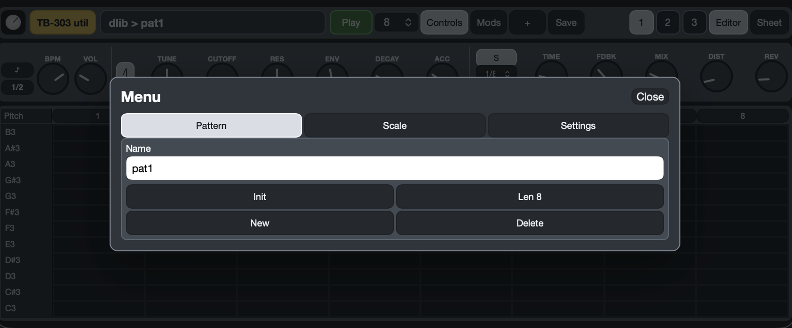
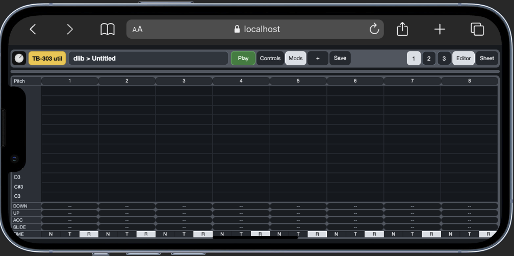
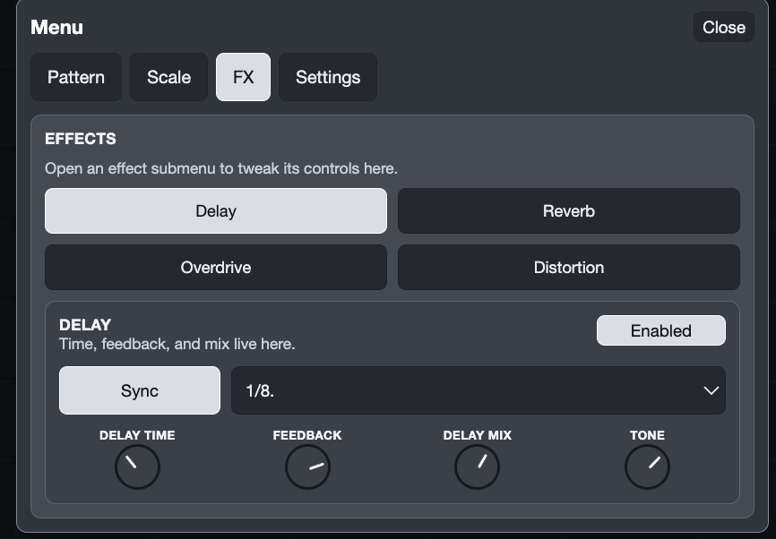
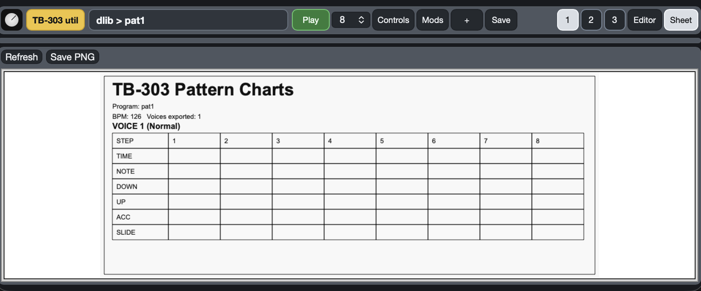

# 303 util User Manual

**303 util** is a tool for TB-303 lovers who care more about writing great patterns than fighting the original hardware workflow. Programming a real 303 can be inspiring, but it can also be slow, awkward, and painfully restrictive when you are trying to explore ideas quickly. This app is built to unlock the pattern-writing side of the TB-303 in a much easier and more practical way, while still respecting what makes the machine special.

With **303 util**, you can sketch, edit, and compare sequences quickly, work on **multiple 303 lines at the same time**, and build patterns with **up to 32 steps per voice**. Instead of getting stuck inside the classic button-combination workflow, you can focus on the musical result: note placement, accents, slides, transpositions, timing, and arrangement across several voices. That makes it much easier to experiment, iterate, and push the pattern capabilities of the 303 further than you comfortably could on the hardware alone.

The goal of the app is **not** to be a perfect sonic emulator of the TB-303. Its main purpose is pattern creation and documentation. Where it really shines is in helping you design patterns clearly, then export a clean sheet you can use to transfer those ideas back to a real 303 later, using the original hardware programming method if you want. In that sense, it is a workflow tool made by and for people who love the TB-303, including the old painful way of entering patterns, but want a better way to get there.

The original sound engine code is based on [thedjinn/js303](https://github.com/thedjinn/js303).

## Quick start

1. Open the app and click the pattern name strip to choose a library and pattern, or click **New** to start a new one.
2. Set the pattern length with the length selector in the top bar.
3. In **Editor**, click notes into the pitch grid.
4. Set each step in the **TIME** row to `N` (note), `T` (tie), or `R` (rest).
5. Add **DOWN**, **UP**, **ACC**, and **SLIDE** where needed.
6. Press **Play** to hear the pattern.
7. Click **Save** to store it in the current library.
8. Switch to **Sheet**, click **Refresh**, then **Save PNG** to export the chart.

## Interface overview

The main screen is built around a few controls you will use constantly:

| Area | What it does |
| --- | --- |
| **TB-303 util button** | Opens the main menu and project options |
| **Pattern name strip** | Shows the current `library > pattern` and opens the library/pattern picker |
| **Length selector** | Sets the active voice length directly from the top bar, up to 32 steps |
| **Play / New / Init / Save** | Playback, create pattern, clear the current pattern, and save |
| **Controls / Mods** | On compact layouts, show or hide the sound controls and step modifier lanes |
| **Voice buttons** | Choose voice `1`, `2`, or `3` for editing |
| **Editor / Sheet** | Switch between sequencing and printable export |

## Libraries, patterns, and saving

The app organizes your work into **libraries** and **patterns**:

- A **library** is a collection.
- A **pattern** is one saved project inside that collection.
- The name strip always shows which library and pattern you are editing.

Important behavior:

- Changes in the editor and controls happen immediately.
- Those changes are **not stored in the library until you click Save**.
- If you switch to another pattern before saving, your current unsaved edits can be lost.

### Open a library or pattern

Click the name strip at the top of the app. On some layouts, the same actions are also available from the main menu.

### Create a new pattern

Use either:

- **New** in the top bar, or
- the **Pattern** section inside the menu

New patterns open as blank projects so you can start sequencing right away.

### Initialize the current pattern

Click **Init** to clear the current pattern back to an empty state.

- This removes notes and modifiers from all active voices.
- It keeps the current voice lengths and timing mode.
- The app asks for confirmation before resetting.

### Save a pattern

Click **Save**.

- If the current pattern already exists, it is updated.
- If it is still unsaved, the app asks for a name and creates it in the current library.

### Create, switch, or delete libraries

Open the library and pattern picker from the name strip, then use it to:

- choose a different library
- create a new library
- delete the current library

The default library (`dlib`) cannot be deleted.

## Building a pattern in Editor

The **Editor** is where you write the sequence for the selected voice.

### Add notes

Click any cell in the pitch grid to place a note on that step. Click the same note again to clear it.

### Set the step type

Use the **TIME** row at the bottom:

- **N** = note
- **T** = tie
- **R** = rest

### Use the classic 303 modifier lanes

The rows above **TIME** add performance behavior to note steps:

- **DOWN**: transpose the note down one octave
- **UP**: transpose the note up one octave
- **ACC**: accent the note
- **SLIDE**: glide into the note from the previous one

### Work with multiple voices

Use the voice buttons to choose which line you are editing.

Each voice has its own:

- notes and modifiers
- pattern length
- waveform and synth settings
- delay, distortion, and reverb settings

Playback runs all active voices together, but you edit one voice at a time.

### Change the pattern length

You can change the active voice length in two places:

- use the **length selector** in the top bar for quick changes
- use **Len** inside the menu on compact layouts

Each voice supports **4 to 32 steps**, and length is stored per voice, so voice 1, 2, and 3 can use different step counts.

## Sound controls

The control strip always edits the **currently selected voice**.

### Main controls

- **BPM**: overall tempo
- **1/2**: halves the current tempo until you toggle it back
- **Wave**: switches between saw and square
- **Tune**: pitch offset
- **Cutoff**
- **Resonance / RES**
- **Env Mod / ENV**
- **Decay**
- **Accent / ACC**
- **Volume / VOL**

### Delay and FX

- **SYNC / FREE** or **S / F**: tempo-synced delay or manual delay time
- **Subdivision**: rhythmic delay value when sync is on
- **Delay Time / TIME**
- **Feedback / FDBK**
- **Mix**
- **Tone**
- **Overdrive / DRV**
- **Distortion / DIST**
- **Reverb / REV**

On phones and small screens, use **Controls** to show or hide the knob section and **Mods** to show or hide the sequencing lanes.

### FX menu sections

Open the menu and switch to the **FX** tab when you want deeper effect editing.

The FX tab is split into four effect sections:

- **Delay**: sync/free mode, subdivision, delay time, feedback, delay mix, and tone
- **Reverb**: amount, tail, pre-delay, and tone
- **Overdrive**: drive amount and tone
- **Distortion**: distortion amount and tone

Each effect has its own **Enabled** toggle. The app allows up to **3 enabled effects at once**, so if three are already active, the next effect button shows **3 Max** until you disable one.

## Scales and project settings

Use the menu to reach the project options:

- the **Scale** tab for **Scale** and **Root** highlighting
- the **FX** tab for detailed effect sections and enable/disable control
- the **Pattern** tab for the project name and pattern length
- **Len** for the active voice, with support for up to 32 steps
- **Voices** to switch between 1, 2, or 3 voice projects
- **Import** and **Export JSON**
- **Export PNG**
- **Google Drive** to connect cloud sync, then **Backup** after connection

Scale highlighting is visual guidance only. It helps you see matching notes, but it does not prevent entering notes outside the selected scale.

## Sheet export: printable real-303 charts

This is the key output of the app: a clean **TB-303 Pattern Chart** you can save, print, or share.

### Export a sheet

1. Finish the pattern you want to document.
2. Choose the voice or voices you want included.
3. Switch to **Sheet**.
4. Click **Refresh**.
5. Click **Save PNG**.

The exported chart includes:

- the program name
- BPM
- the number of voices exported
- a separate block for each exported voice
- step columns for the current pattern length, including longer 32-step patterns
- **TIME**, **NOTE**, **DOWN**, **UP**, **ACC**, and **SLIDE** rows

This makes the export practical as a real 303 reference sheet, not just a screenshot of the editor.

## JSON import/export and backup

### Export JSON

Use **Export JSON** when you want a project file you can archive, move to another device, or send to someone else.

### Import JSON

Use **Import** to load a project file back into the app. After importing, click **Save** if you also want it added to the current library.

### Google Drive backup

Use **Google Drive** to connect cloud sync. After connection, the same area gives you **Backup** for manual backup runs. Save your pattern first if you want the latest edits included in backup data.

## Recommended workflow

1. Choose or create a **Library**.
2. Create a **New Pattern**.
3. Build the sequence in **Editor**.
4. Shape the sound for each voice.
5. Save regularly.
6. Open **Sheet** and export the final chart.
7. Export **JSON** or run backup if you want an extra copy.

## Practical tips

- Save before switching libraries or patterns.
- Use separate libraries for different songs, sets, or sessions.
- Use **Sheet** view as the final check before sharing a pattern.
- On compact layouts, **Controls** and **Mods** are your fastest way to switch between sound design and sequencing.
